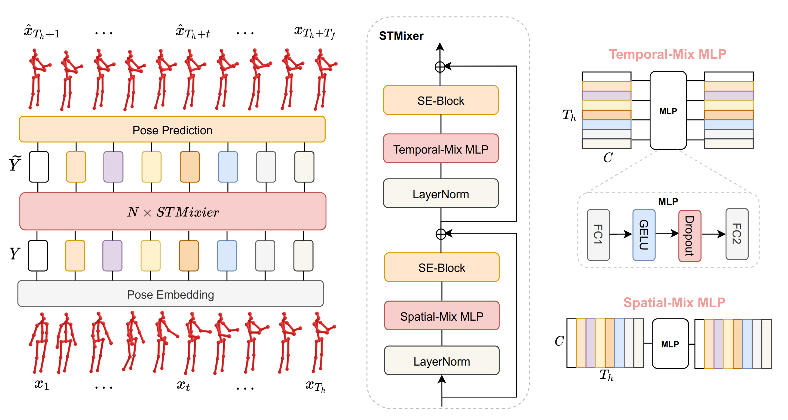

# Convolutional Mixer

Aleksei Zhuravlev and Valentin von Bornhaupt

## Project Structure

* **Datasets**
  - conv_mixer/dataset_ais_xyz.py - dataset class for AIS lab dataset
  - h36m/datasets/dataset_h36m.py - dataset class for H3.6m dataset, xyz format
  - h36m/datasets/dataset_h36m_ang.py - dataset class for H3.6m dataset, axis-angle format
* **Encoding**
  - conv_mixer/encoding/positional_encoding.py - encoding of pose vector, with an option to add sinusoidal encoding
* **Model**
  - h36m/conv_mixer_model.py - ConvMixer model
* **Training**
  - h36m/train_mixer_ais.py - training script for AIS lab dataset
  - h36m/train_mixer_h36m.py - training script for H3.6m dataset
* **Hyperparameter search**
  - optuna_search/conv_optuna_main.py - hyperparameter search for both datasets
* **Visualization**
  - conv_mixer/utils/visualization_helpers_ais.py - functions for visualization of AIS dataset
  - conv_mixer/utils/visualization_helpers_h3m.py - functions for visualization of H3.6m dataset
  - conv_mixer/utils/visualization - gifs and images used in this notebook

## References

- https://github.com/MotionMLP/MotionMixer
- https://optuna.org/
- https://pytorch.org/

